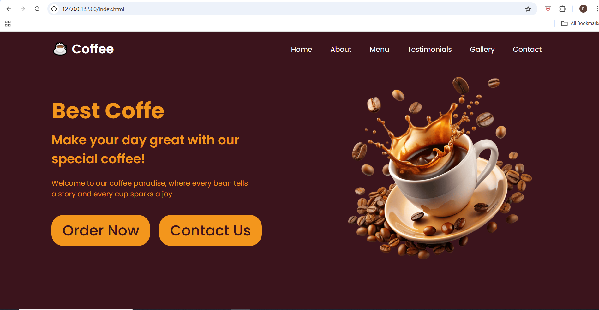
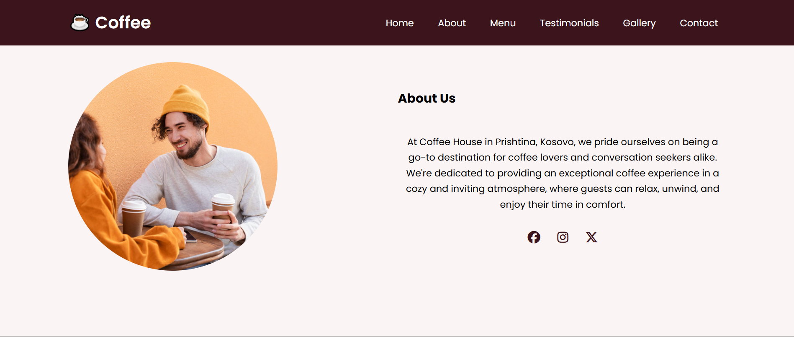
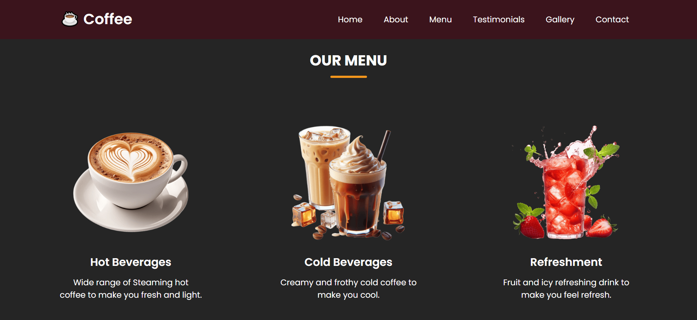
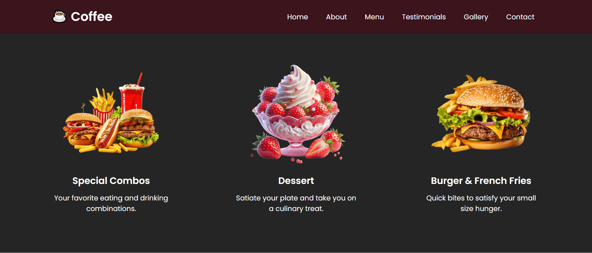
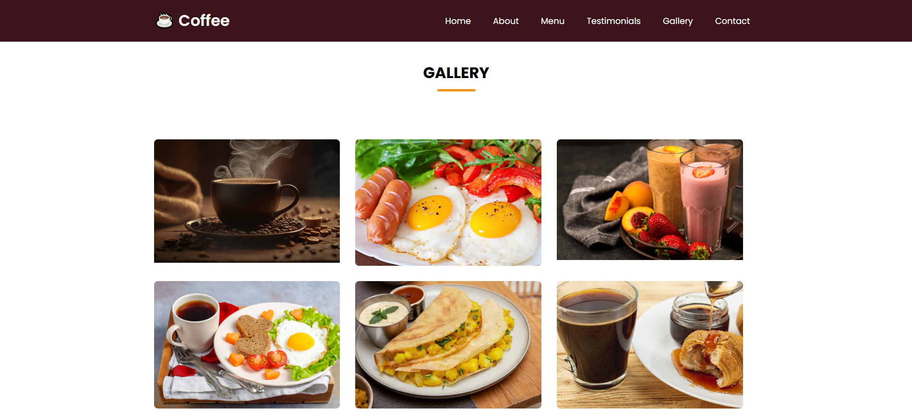
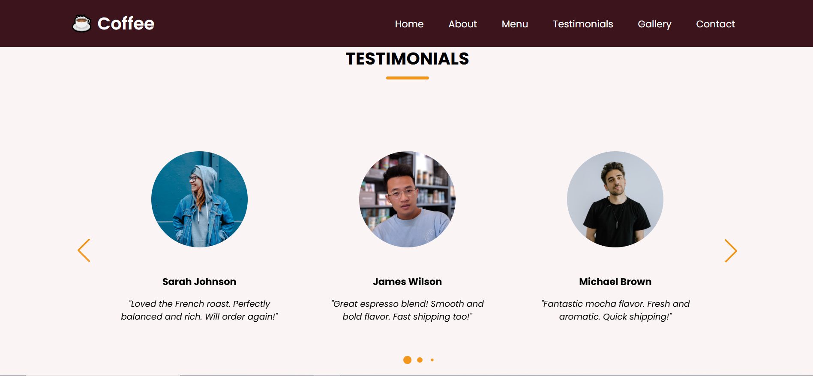
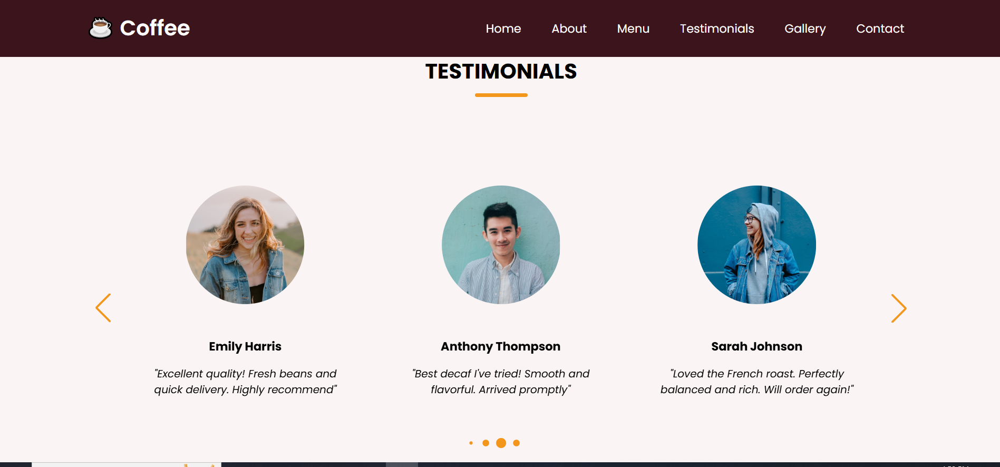
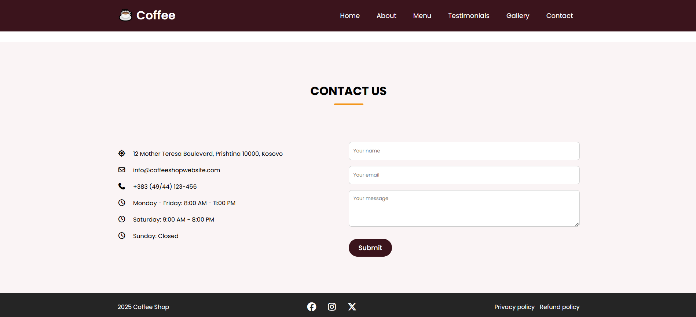

# Coffee Website

A modern, responsive landing website for a coffee brand / coffee shop built with **HTML**, **CSS**, and **JavaScript**.  
The goal of this project is to present a clean UI, smooth navigation, and a structured multi-section layout that works well on desktop and mobile.

## Demo
Run locally by opening `index.html` in your browser, or use VS Code **Live Server** for the best experience.

## Features
- **Responsive layout** (desktop, tablet, mobile)
- **Sticky navigation** with smooth section scrolling
- **Hero section** with call-to-action
- **About section** (brand story / highlights)
- **Menu section** showcasing products
- **Testimonials carousel/slider** (interactive UI component)
- **Gallery section** for visuals
- **Contact section** (form UI)
- **Clean styling system** using reusable CSS classes and consistent spacing/typography

## Tech Stack
- **HTML5** for semantic structure
- **CSS3** (Flexbox/Grid, responsive design, custom styling)
- **JavaScript (ES6)** for interactivity and UI behavior

## Project Structure
```text
Coffee-Website/
├─ index.html
├─ style.css
├─ script.js
└─ images/
   └─ screenshots/


## Screenshots

### Home


### About


### Menu



### Gallery


### Testimonials



### Contact

